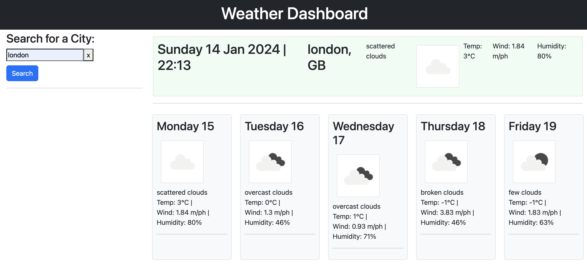

# weather-dashboard
EDx Bootcamp challenge - Create a weather app

## Description

* Create a weather dashboard with form inputs.
  * When a user searches for a city they are presented with current and future conditions for that city and that city is added to the search history
  * When a user views the current weather conditions for that city they are presented with:
    * The city name
    * The date
    * An icon representation of weather conditions
    * The temperature
    * The humidity
    * The wind speed
  * When a user view future weather conditions for that city they are presented with a 5-day forecast that displays:
    * The date
    * An icon representation of weather conditions
    * The temperature
    * The humidity
  * When a user click on a city in the search history they are again presented with current and future conditions for that city

## Usage

Link to deployed page
https://vilmaglynn.github.io/weather-dashboard/

## License
MIT License

Copyright (c) 2023 Vilma Hernandez
